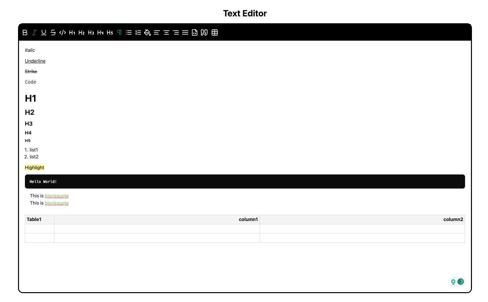

<div align="center">

# Tiptap Editor

**A Notion-style, local-first block editor for the web.**
Built with [Tiptap](https://tiptap.dev), React 19, TailwindCSS and shadcn/ui — entirely from free Tiptap extensions.

[](./LICENSE)
[](https://react.dev)
[](https://tiptap.dev)
[](https://vitejs.dev)
[](https://www.typescriptlang.org)
[](#-contributing)

[**Live demo →**](https://text-editor-tiptap.vercel.app)



</div>

---

## ✨ Features

| | |
|---|---|
| 📝 **Notion-style writing** | Slash `/` commands, selection bubble menu with **Turn-into** dropdown, floating `+` button on empty lines |
| 📋 **Google Docs-style menu bar** | Full **File / Edit / View / Insert / Format / Tools / Extensions / Help** menus with cascading submenus |
| 🖱️ **Drag handle + block menu** | Hover any block to reveal `⋮⋮` and `+` icons. Drag to reorder, click for **Turn into / Duplicate / Delete / Reset / colors / highlight** |
| 🗂 **Multi-document workspace** | Create, rename, duplicate, delete, star and emoji-tag pages from the sidebar |
| 🎨 **Cover images** | Pick from a built-in Unsplash gallery, paste a URL, or upload from disk |
| 💾 **Local-first persistence** | Auto-saves every keystroke to `localStorage`. No accounts, no servers, no telemetry |
| 🌓 **Dark / light / system theme** | Persisted across sessions, respects OS preference |
| 🔍 **Find / Replace** | `⌘F` to find, `⌘⇧H` to replace, with case-sensitive toggle |
| ⌘  **Command palette** | `⌘K` to jump between pages, create from templates, run actions |
| 🧵 **Inline threads (free!)** | Comment on selections with replies and resolve — works without Tiptap Pro/Cloud |
| @ **Page mentions** | `@` to link to other pages with autocomplete |
| 📐 **Outline panel** | Auto-generated table of contents that scrolls to headings |
| 🧮 **Math equations** | Inline `$x$` and block LaTeX rendered with KaTeX |
| ⚡ **Smart typography** | Smart quotes, em-dashes, ellipses, arrows |
| ☑️ **Task lists** | `[ ]` checkboxes with nesting |
| 🔗 **Smart links** | In-place popover that accepts **URL or email** (auto-prefixes `https://` for bare domains and `mailto:` for emails); auto-link + paste-to-link; opens in a new tab safely |
| 🖼 **Media** | Images, YouTube embeds, resizable tables |
| 💻 **Syntax-highlighted code** | Powered by [lowlight](https://github.com/wooorm/lowlight) |
| 📥 **Import / Export** | `.docx` import (via [mammoth](https://github.com/mwilliamson/mammoth.js)); export to **Markdown / HTML / Plain text / JSON / PDF (Print)** plus clipboard copy |
| 🔢 **Word count dialog** | Words, characters (with/without spaces), sentences, paragraphs, reading time |
| 🔠 **Rich formatting** | H1–H6, alignment, line spacing, font family, text/highlight colors, change-case (UPPER/lower/Title/Sentence), super/subscript |
| ✨ **Insert anything** | Page break, signature line, special characters, emoji picker, today's date / current time |
| 🔎 **Zoom** | `⌘+` / `⌘-` / `⌘0` to zoom the editor surface |
| ⌨️ **Keyboard-friendly** | All standard shortcuts (`⌘B`, `⌘I`, `⌘K`, `⌘Z`, …) |
| 🚀 **Production performance** | Code-split bundles, lazy-loaded heavy deps, no `moment.js` |

> **Free-extension only.** This project avoids paid Tiptap Cloud / Pro features (Comments, Drag-context-menu, etc.). The drag handle uses the open-source `@tiptap/extension-drag-handle-react`; threads are implemented as a custom mark; the block menu is built from shadcn/ui primitives.

### 📋 Menu bar at a glance

| Menu | What's inside |
|---|---|
| **File** | New (blank + every template), Open, Make a copy, Rename, Star, Set emoji, Cover image, Import .docx, Download (Markdown / HTML / TXT / JSON / PDF), Print, Move to trash |
| **Edit** | Undo, Redo, Cut, Copy, Paste, Paste without formatting, Select all, Delete selection, Find, Find & replace |
| **View** | Show toolbar, Read-only mode, Zoom (50–200%), Theme (Light / Dark / System), Full screen |
| **Insert** | Image, Link, Cover image, Table (3×3 + custom), Code block, Quote, Horizontal divider, Line break, Page break, Signature line, YouTube, LaTeX equation (block / inline), Mention, Date / time, Special character, Emoji |
| **Format** | Text marks, Paragraph styles (Normal + H1–H6), Align, Line spacing, Lists & indent, Text color, Highlight, Font family, Change case, Clear formatting |
| **Tools** | Word count, Command palette, Find & replace, Copy as Markdown / HTML, Reading mode, Spelling suggestions |
| **Extensions** | Templates, Browse Tiptap extensions, GitHub repo |
| **Help** | Keyboard shortcuts, About, Report a bug, GitHub repo, Tiptap docs |

## 🚀 Quick start

```bash
# Requires Node >= 18.18
npm install
npm run dev
```

Then open <http://localhost:5173>.

### Other scripts

```bash
npm run build       # type-check + production build
npm run preview     # preview the production build locally
npm run typecheck   # tsc --noEmit
npm run lint        # eslint
```

## 🧱 Stack

- **Editor:** [Tiptap 3](https://tiptap.dev) on [ProseMirror](https://prosemirror.net)
- **Drag handle:** [`@tiptap/extension-drag-handle-react`](https://tiptap.dev/docs/editor/extensions/functionality/drag-handle) (free, open source)
- **Framework:** [React 19](https://react.dev) + [React Router 7](https://reactrouter.com)
- **Build:** [Vite 7](https://vitejs.dev) with manual chunking
- **Styling:** [TailwindCSS 4](https://tailwindcss.com), [@tailwindcss/typography](https://github.com/tailwindlabs/tailwindcss-typography)
- **UI primitives:** [Radix UI](https://www.radix-ui.com) + [shadcn/ui](https://ui.shadcn.com) patterns
- **Icons:** [lucide-react](https://lucide.dev)
- **Math:** [KaTeX](https://katex.org)
- **Date utils:** [date-fns](https://date-fns.org)
- **Suggestion popups:** [tippy.js](https://atomiks.github.io/tippyjs/)
- **Language:** TypeScript (strict mode)

## ⌨️ Keyboard shortcuts

| Shortcut | Action |
|---|---|
| `/` | Open the slash command menu |
| `@` | Mention / link another page |
| `⌘ K` | Open the command palette |
| `⌘ F` | Find in page |
| `⌘ ⇧ H` | Find & replace |
| `⌘ /` | Show shortcuts cheatsheet |
| `⌘ +` / `⌘ -` / `⌘ 0` | Zoom in / out / reset |
| `⌘ B` | Bold |
| `⌘ I` | Italic |
| `⌘ U` | Underline |
| `⌘ Z` / `⌘ ⇧ Z` | Undo / Redo |
| `# `, `## `, `### ` | Heading 1 / 2 / 3 (markdown shortcut) |
| `> ` | Blockquote |
| `- ` / `* ` | Bullet list |
| `1. ` | Numbered list |
| ` ``` ` | Code block |
| `$x$` | Inline math (KaTeX) |

## 🗂 Project structure

```
src/
├─ contexts/                    # React contexts (documents, editor, global)
├─ extensions/                  # Custom Tiptap extensions
│  ├─ SlashCommand.tsx          #   /-menu (14 block types)
│  ├─ Math.tsx                  #   inline + block LaTeX (KaTeX)
│  ├─ Mention.tsx               #   @-page mentions
│  └─ MentionList.tsx           #   keyboard-navigable suggestion list
├─ hooks/                       # useDebouncedCallback, useTheme, …
├─ lib/                         # storage, markdown export, templates, types
├─ pages/
│  ├─ Editor/
│  │  ├─ index.tsx              # thin EditorShell — composes everything
│  │  ├─ Sidebar.tsx            # pages list, search, templates
│  │  ├─ Header.tsx             # title, save state, cover, theme, export
│  │  ├─ MenuBar.tsx            # Google Docs-style File/Edit/View/… menu
│  │  ├─ Toolbar.tsx            # mark/heading/list/highlight/font/math
│  │  ├─ EditorMenus.tsx        # composes the 3 in-editor surfaces:
│  │  ├─ BlockMenu.tsx          #   ⋮⋮ + ➕ drag handle and block menu
│  │  ├─ BubbleMenuBar.tsx      #   selection bubble (turn-into, link)
│  │  ├─ LinkPopover.tsx        #   inline link editor (replaces prompt)
│  │  ├─ CommandPalette.tsx     # ⌘K palette
│  │  ├─ FindReplace.tsx        # ⌘F find / ⌘⇧H replace
│  │  ├─ ShortcutsDialog.tsx    # ⌘/ cheatsheet
│  │  ├─ CoverImageDialog.tsx   # gallery + URL + upload cover picker
│  │  ├─ RightPanel.tsx         # tabbed: Outline · Threads
│  │  ├─ Outline.tsx            # auto-generated TOC
│  │  ├─ ThreadPanel.tsx        # comments / threads UI
│  │  ├─ StatusBar.tsx          # word/char count, reading time
│  │  ├─ ExportMenu.tsx         # md / html / docx / clipboard / print
│  │  ├─ ThemeToggle.tsx        # light / dark / system
│  │  ├─ constants.ts           # colors, fonts, emojis
│  │  └─ getHeadings.ts         # parse JSONContent → headings
│  └─ Error/                    # 404
├─ components/ui/               # shadcn/ui primitives (button, dialog,
│                               #   dropdown-menu, popover, …)
└─ utils/TiptapExtension/
   └─ ThreadExtension.tsx       # custom Thread mark + unsetThreadById
```

Documents persist to `localStorage` under three namespaced keys:

```
tiptap-editor:documents:v1   → { [id]: Document }
tiptap-editor:active-doc:v1  → string (id)
tiptap-editor:theme:v1       → "light" | "dark" | "system"
```

## 🗺 Roadmap

- [x] Drag-and-drop block reordering — shipped via the drag handle
- [x] Inline link editor with URL + email auto-detection (no `prompt()` dialogs)
- [x] Cover image picker with gallery / URL / upload
- [x] Print-to-PDF (browser print)
- [ ] Optional cloud sync (BYO backend)
- [ ] Wiki-style `[[backlinks]]`
- [ ] Real-time collaboration via Yjs (self-hosted)
- [ ] Native PDF export (no print dialog)
- [ ] Mobile-friendly drag handle

Have an idea? [Open an issue](https://github.com/ZanyuanYang/Text-Editor-Tiptap/issues/new/choose) — PRs welcome.

## 🤝 Contributing

Contributions, issues and feature requests are welcome.

1. Fork the repo and create your branch from `master`
2. `npm install`, `npm run dev`
3. Run `npm run typecheck && npm run build` before submitting
4. Open a PR using the provided template

See [CONTRIBUTING.md](./CONTRIBUTING.md) for the full guide.

## 📄 License

[MIT](./LICENSE) © Zanyuan Yang and contributors.

---

<div align="center">

**[⬆ Back to top](#tiptap-editor)**

If this project helped you, ⭐ the repo to support it.

</div>
