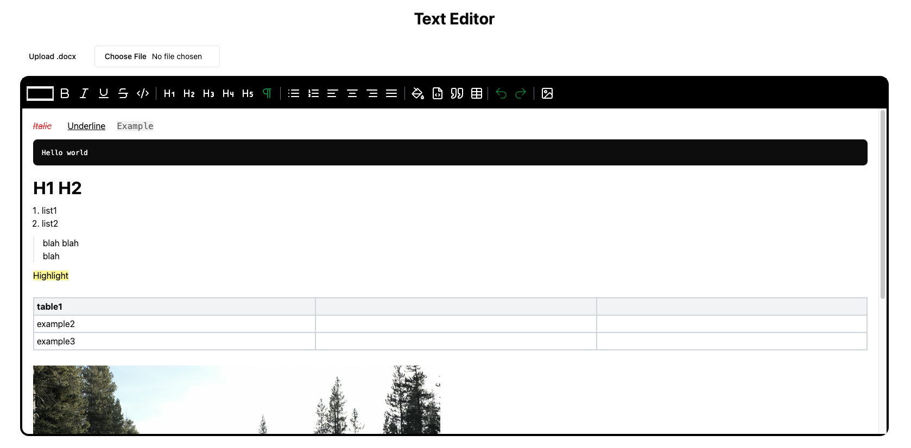
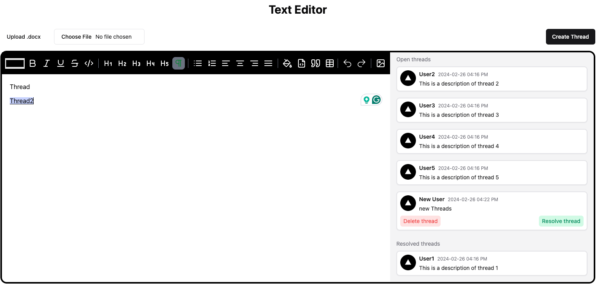

# Tiptap Text Editor

A text editor built with [Tiptap](https://tiptap.dev/) and [TailwindCSS](https://tailwindcss.com/) for React.



## 🧑🏻‍💻 Demo
[text-editor-tiptap.vercel.app](https://text-editor-tiptap.vercel.app/)

## 🚀 Installation
Open a terminal and run:
```bash
npm install
npm run dev
```
Visit http://localhost:5173/ in your browser.

## ⛑️ Features

- [Create Threads](https://tiptap.dev/docs/editor/comments/introduction)
  - Same feature as comments in Tiptap(`Beta` Requirement), but I build it own(`Free`).
  - 
- Upload .docx 
- Heading
- Bold
- Italic
- Underline
- Strikethrough
- Code
- Blockquote
- Bullet List
- Ordered List
- Code Block
- Alignment(Left, Center, Right, Justify)
- Table
- Color
- Redo & Undo
- Image(This extension does only the rendering of images.)


## 📄 License
[MIT](./LICENSE)
